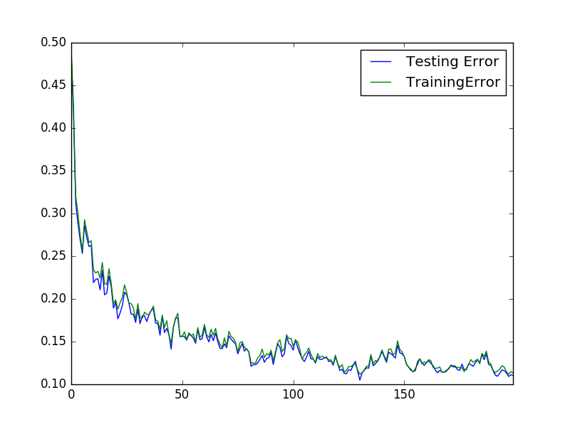
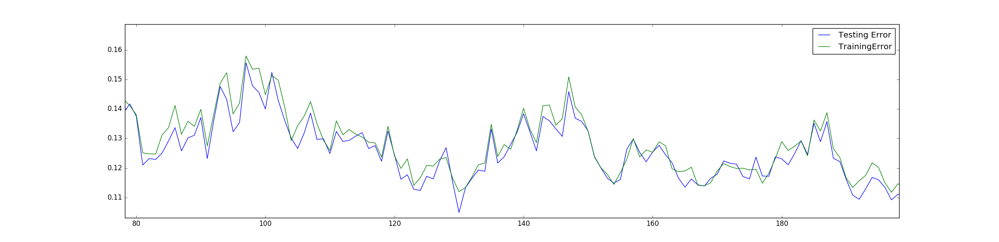
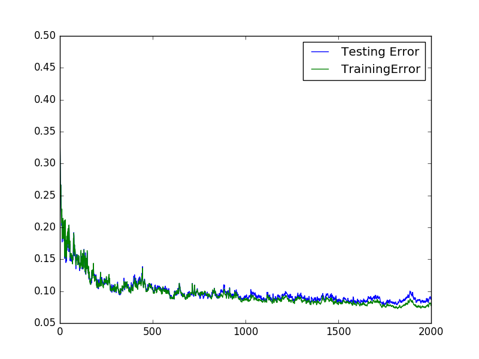
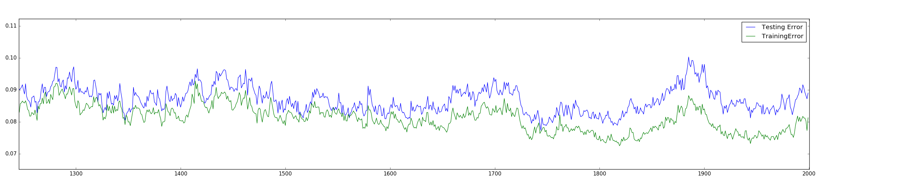

# The MNIST example

Since MNIST is the gold standard when creating a classifier, I decided to use it here too.

If you want to try it by yourself, you can just run

    python3 demo_mnist.py

Such a script will download the MNIST dataset from [Yan LeCunn website](http://yann.lecun.com/exdb/mnist/), unless already present in the `./data` folder. 

The network that we are using here has shape `[784, 50, 30, 10]`. The training will span 200 epochs with a mini-batch size of 200. At the end of each epoch the training and testing error are printed out on the console. At the end a graph showing both errors is displayed.

Considering the fact that this example uses a the sigmoid activations function with a mean squared error (as of today, ReLu and negative log-likelihood are considered more suitable for classification purposes), no learning rate adaptation and no convolutions, I consider the error rate of ~10% very satisfying.

A pre-trained model is also included [here](models/mnist.json). Please note that if you are going to train your own network, the results might be slightly different due to the stochastic nature of the algorithm.

## The graphs

This is the result I obtained after 200 iterations

and a zoom on the tail of the graph

I let the same script running for 2000 epochs, obtaining
 the following results: 

as we can see we are able to to below 10% of error rate after 1300 epochs

